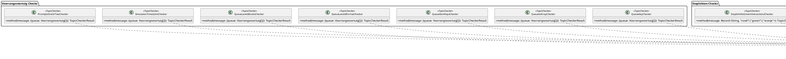

# Checker implementations

```plantuml
@startuml
skinparam classAttributeIconSize 0
skinparam classFontSize 12

' Core interface
interface TopicChecker<T> {
  + method(message: T): TopicCheckerResult
  + name: String
  + description: String
  + checksFor: String
}

'── Voorrangsvoertuig Checks ────────────────────────────────────────────────────
package "Voorrangsvoertuig Checks" {
  class QueueKeyChecker <<TopicChecker>> {
    + method(message: {queue: Voorrangsvoertuig[]}): TopicCheckerResult
  }
  class QueueIsArrayChecker <<TopicChecker>> {
    + method(message: {queue: Voorrangsvoertuig[]}): TopicCheckerResult
  }
  class QueueItemKeysChecker <<TopicChecker>> {
    + method(message: {queue: Voorrangsvoertuig[]}): TopicCheckerResult
  }
  class QueueLaneIdFormatChecker <<TopicChecker>> {
    + method(message: {queue: Voorrangsvoertuig[]}): TopicCheckerResult
  }
  class QueueLaneIdExistsChecker <<TopicChecker>> {
    + method(message: {queue: Voorrangsvoertuig[]}): TopicCheckerResult
  }
  class SimulationTimesIsIntChecker <<TopicChecker>> {
    + method(message: {queue: Voorrangsvoertuig[]}): TopicCheckerResult
  }
  class PriorityIsOneOrTwoChecker <<TopicChecker>> {
    + method(message: {queue: Voorrangsvoertuig[]}): TopicCheckerResult
  }
}

'── Stoplichten Checks ─────────────────────────────────────────────────────────
package "Stoplichten Checks" {
  class StoplichtIdFormatChecker <<TopicChecker>> {
    + method(message: Record<String,String>): TopicCheckerResult
  }
  class StoplichtStatesValidChecker <<TopicChecker>> {
    + method(message: Record<String, "rood"\|"groen"\|"oranje">): TopicCheckerResult
  }
  class StoplichtIncludedIdsKnownChecker <<TopicChecker>> {
    + method(message: Record<String,any>): TopicCheckerResult
  }
  class StoplichtAllIdsIncludedChecker <<TopicChecker>> {
    + method(message: Record<String,any>): TopicCheckerResult
  }
  class StoplichtNoGreenIntersectionsChecker <<TopicChecker>> {
    + method(message: Record<String, "rood"\|"groen"\|"oranje">): TopicCheckerResult
  }
}

'── Sensoren Rijbaan Checks ────────────────────────────────────────────────────
package "Sensoren Rijbaan Checks" {
  class SRIDFormatChecker <<TopicChecker>> {
    + method(message: Record<String,{voor:boolean,achter:boolean}>): TopicCheckerResult
  }
  class SRIDsExistChecker <<TopicChecker>> {
    + method(message: Record<String,{voor:boolean,achter:boolean}>): TopicCheckerResult
  }
  class SRAllKnownIdsIncludedChecker <<TopicChecker>> {
    + method(message: Record<String,{voor:boolean,achter:boolean}>): TopicCheckerResult
  }
  class SRKeysChecker <<TopicChecker>> {
    + method(message: Record<String,{voor:boolean,achter:boolean}>): TopicCheckerResult
  }
  class SRValuesChecker <<TopicChecker>> {
    + method(message: Record<String,{voor:boolean,achter:boolean}>): TopicCheckerResult
  }
}

'── Sensoren Speciaal Checks ────────────────────────────────────────────────────
package "Sensoren Speciaal Checks" {
  class SSIdsChecker <<TopicChecker>> {
    + method(message: Record<String,boolean>): TopicCheckerResult
  }
  class SSValuesChecker <<TopicChecker>> {
    + method(message: Record<String,boolean>): TopicCheckerResult
  }
}

'── Tijd Checks ────────────────────────────────────────────────────────────────
package "Tijd Checks" {
  class TijdKeyChecker <<TopicChecker>> {
    + method(message: {simulatie_tijd_ms:number}): TopicCheckerResult
  }
  class TijdValueIntChecker <<TopicChecker>> {
    + method(message: {simulatie_tijd_ms:number}): TopicCheckerResult
  }
}

'── Relationships ─────────────────────────────────────────────────────────────
QueueKeyChecker                   ..|> TopicChecker
QueueIsArrayChecker               ..|> TopicChecker
QueueItemKeysChecker              ..|> TopicChecker
QueueLaneIdFormatChecker          ..|> TopicChecker
QueueLaneIdExistsChecker          ..|> TopicChecker
SimulationTimesIsIntChecker       ..|> TopicChecker
PriorityIsOneOrTwoChecker         ..|> TopicChecker

StoplichtIdFormatChecker          ..|> TopicChecker
StoplichtStatesValidChecker       ..|> TopicChecker
StoplichtIncludedIdsKnownChecker  ..|> TopicChecker
StoplichtAllIdsIncludedChecker    ..|> TopicChecker
StoplichtNoGreenIntersectionsChecker ..|> TopicChecker

SRIDFormatChecker                 ..|> TopicChecker
SRIDsExistChecker                 ..|> TopicChecker
SRAllKnownIdsIncludedChecker      ..|> TopicChecker
SRKeysChecker                     ..|> TopicChecker
SRValuesChecker                   ..|> TopicChecker

SSIdsChecker                      ..|> TopicChecker
SSValuesChecker                   ..|> TopicChecker

TijdKeyChecker                    ..|> TopicChecker
TijdValueIntChecker               ..|> TopicChecker
@enduml
```