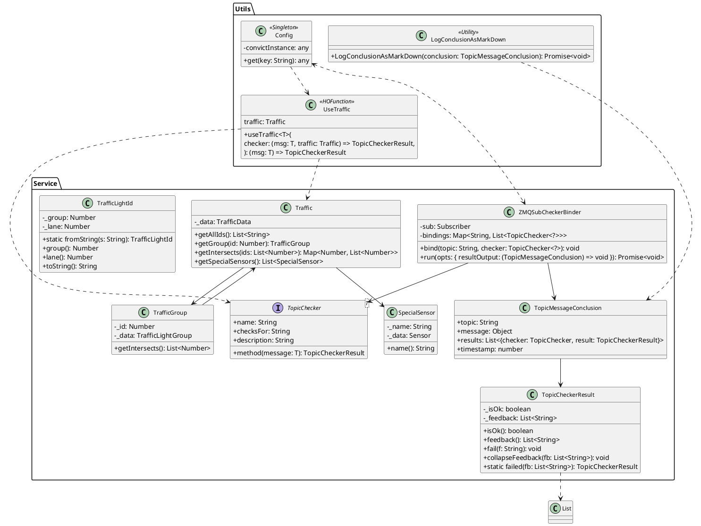

# overview

```plantuml
@startuml
skinparam classAttributeIconSize 0
skinparam classFontSize 12
skinparam stereotypeFontSize 10

'--- Service Layer ---
package Service {
  
  class ZMQSubCheckerBinder {
    - sub: Subscriber
    - bindings: Map<String, List<TopicChecker<?>>>
    + bind(topic: String, checker: TopicChecker<?>): void
    + run(opts: { resultOutput: (TopicMessageConclusion) => void }): Promise<void>
  }

  interface TopicChecker<T> {
    + method(message: T): TopicCheckerResult
    + name: String
    + checksFor: String
    + description: String
  }

  class TopicCheckerResult {
    - _isOk: boolean
    - _feedback: List<String>
    + isOk(): boolean
    + feedback(): List<String>
    + fail(f: String): void
    + collapseFeedback(fb: List<String>): void
    + static failed(fb: List<String>): TopicCheckerResult
  }

  class TopicMessageConclusion {
    + topic: String
    + message: Object
    + results: List<{checker: TopicChecker, result: TopicCheckerResult}>
    + timestamp: number
  }

  class Traffic {
    - _data: TrafficData
    + getAllIds(): List<String>
    + getGroup(id: Number): TrafficGroup
    + getIntersects(ids: List<Number>): Map<Number, List<Number>>
    + getSpecialSensors(): List<SpecialSensor>
  }

  class TrafficGroup {
    - _id: Number
    - _data: TrafficLightGroup
    + getIntersects(): List<Number>
  }

  class TrafficLightId {
    - _group: Number
    - _lane: Number
    + static fromString(s: String): TrafficLightId
    + group(): Number
    + lane(): Number
    + toString(): String
  }

  class SpecialSensor {
    - _name: String
    - _data: Sensor
    + name(): String
  }
}

'--- Utilities & Config ---
package Utils {
  class UseTraffic <<HOFunction>> {
    + useTraffic<T>(
        checker: (msg: T, traffic: Traffic) => TopicCheckerResult,
        traffic: Traffic
      ): (msg: T) => TopicCheckerResult
  }

  class LogConclusionAsMarkDown <<Utility>> {
    + LogConclusionAsMarkDown(conclusion: TopicMessageConclusion): Promise<void>
  }

  class Config <<Singleton>> {
    - convictInstance: any
    + get(key: String): any
  }
}

'--- Relationships ---
ZMQSubCheckerBinder --> TopicChecker
ZMQSubCheckerBinder --> TopicMessageConclusion
TopicMessageConclusion --> TopicCheckerResult
TopicCheckerResult ..> List
Traffic --> TrafficGroup
Traffic --> SpecialSensor
TrafficGroup --> Traffic
UseTraffic ..> Traffic
UseTraffic ..> TopicChecker
LogConclusionAsMarkDown ..> TopicMessageConclusion
Config ..> UseTraffic
Config <..> ZMQSubCheckerBinder

@enduml

```